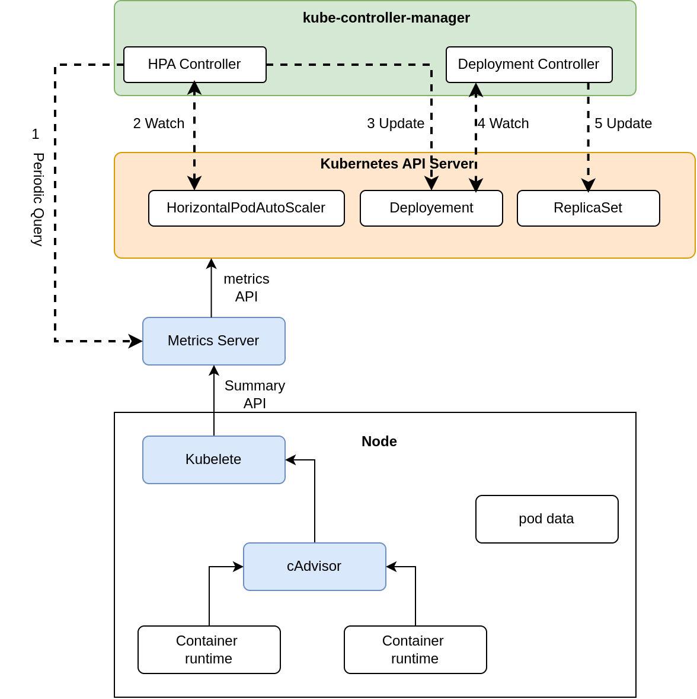
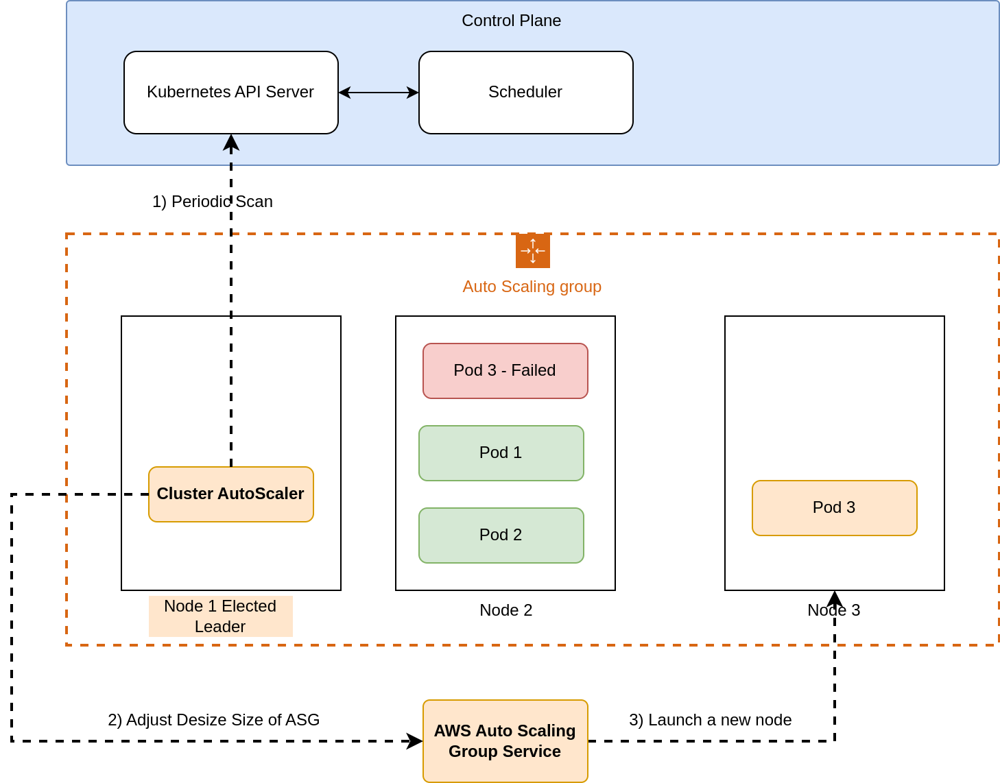

## Introduction

[Github](https://github.com/cdk-entest/eks-cdk-web) this note shows

- Kubernetes Horizontal Pod AutoScaler
- Kubernetes Vertial Pod AutoScaler
- [AutoScaler](https://docs.aws.amazon.com/eks/latest/userguide/autoscaling.html) (scale number of nodes)
- Deployment, service, and load test
- [My note](https://d2cvlmmg8c0xrp.cloudfront.net/book/amazon_eks_auto_scaling_haimtran.pdf)

Please note two ways

- Use ServiceAccount
- Use IAM for NodeRole

> Cluster Autoscaler requires the ability to examine and modify EC2 Auto Scaling Groups. We recommend using IAM roles for Service Accounts to associate the Service Account that the Cluster Autoscaler Deployment runs as with an IAM role that is able to perform these functions. If you are unable to use IAM Roles for Service Accounts, you may associate an IAM service role with the EC2 instance on which the Cluster Autoscaler pod runs.

## Setup

Setup NodeRole with following permissions

```json
{
  "Version": "2012-10-17",
  "Statement": [
    {
      "Effect": "Allow",
      "Action": [
        "autoscaling:DescribeAutoScalingGroups",
        "autoscaling:DescribeAutoScalingInstances",
        "autoscaling:DescribeLaunchConfigurations",
        "autoscaling:DescribeScalingActivities",
        "autoscaling:DescribeTags",
        "ec2:DescribeInstanceTypes",
        "ec2:DescribeLaunchTemplateVersions"
      ],
      "Resource": ["*"]
    },
    {
      "Effect": "Allow",
      "Action": [
        "autoscaling:SetDesiredCapacity",
        "autoscaling:TerminateInstanceInAutoScalingGroup",
        "ec2:DescribeImages",
        "ec2:GetInstanceTypesFromInstanceRequirements",
        "eks:DescribeNodegroup"
      ],
      "Resource": ["*"]
    }
  ]
}
```

Then install the cluster-autoscaler-autodiscover.yaml

<details> 
 <summary>cluster-autoscaler-autodiscover.yaml </summary>

```yaml
---
apiVersion: v1
kind: ServiceAccount
metadata:
  labels:
    k8s-addon: cluster-autoscaler.addons.k8s.io
    k8s-app: cluster-autoscaler
  name: cluster-autoscaler
  namespace: kube-system
---
apiVersion: rbac.authorization.k8s.io/v1
kind: ClusterRole
metadata:
  name: cluster-autoscaler
  labels:
    k8s-addon: cluster-autoscaler.addons.k8s.io
    k8s-app: cluster-autoscaler
rules:
  - apiGroups: [""]
    resources: ["events", "endpoints"]
    verbs: ["create", "patch"]
  - apiGroups: [""]
    resources: ["pods/eviction"]
    verbs: ["create"]
  - apiGroups: [""]
    resources: ["pods/status"]
    verbs: ["update"]
  - apiGroups: [""]
    resources: ["endpoints"]
    resourceNames: ["cluster-autoscaler"]
    verbs: ["get", "update"]
  - apiGroups: [""]
    resources: ["nodes"]
    verbs: ["watch", "list", "get", "update"]
  - apiGroups: [""]
    resources:
      - "namespaces"
      - "pods"
      - "services"
      - "replicationcontrollers"
      - "persistentvolumeclaims"
      - "persistentvolumes"
    verbs: ["watch", "list", "get"]
  - apiGroups: ["extensions"]
    resources: ["replicasets", "daemonsets"]
    verbs: ["watch", "list", "get"]
  - apiGroups: ["policy"]
    resources: ["poddisruptionbudgets"]
    verbs: ["watch", "list"]
  - apiGroups: ["apps"]
    resources: ["statefulsets", "replicasets", "daemonsets"]
    verbs: ["watch", "list", "get"]
  - apiGroups: ["storage.k8s.io"]
    resources:
      ["storageclasses", "csinodes", "csidrivers", "csistoragecapacities"]
    verbs: ["watch", "list", "get"]
  - apiGroups: ["batch", "extensions"]
    resources: ["jobs"]
    verbs: ["get", "list", "watch", "patch"]
  - apiGroups: ["coordination.k8s.io"]
    resources: ["leases"]
    verbs: ["create"]
  - apiGroups: ["coordination.k8s.io"]
    resourceNames: ["cluster-autoscaler"]
    resources: ["leases"]
    verbs: ["get", "update"]
---
apiVersion: rbac.authorization.k8s.io/v1
kind: Role
metadata:
  name: cluster-autoscaler
  namespace: kube-system
  labels:
    k8s-addon: cluster-autoscaler.addons.k8s.io
    k8s-app: cluster-autoscaler
rules:
  - apiGroups: [""]
    resources: ["configmaps"]
    verbs: ["create", "list", "watch"]
  - apiGroups: [""]
    resources: ["configmaps"]
    resourceNames:
      ["cluster-autoscaler-status", "cluster-autoscaler-priority-expander"]
    verbs: ["delete", "get", "update", "watch"]

---
apiVersion: rbac.authorization.k8s.io/v1
kind: ClusterRoleBinding
metadata:
  name: cluster-autoscaler
  labels:
    k8s-addon: cluster-autoscaler.addons.k8s.io
    k8s-app: cluster-autoscaler
roleRef:
  apiGroup: rbac.authorization.k8s.io
  kind: ClusterRole
  name: cluster-autoscaler
subjects:
  - kind: ServiceAccount
    name: cluster-autoscaler
    namespace: kube-system

---
apiVersion: rbac.authorization.k8s.io/v1
kind: RoleBinding
metadata:
  name: cluster-autoscaler
  namespace: kube-system
  labels:
    k8s-addon: cluster-autoscaler.addons.k8s.io
    k8s-app: cluster-autoscaler
roleRef:
  apiGroup: rbac.authorization.k8s.io
  kind: Role
  name: cluster-autoscaler
subjects:
  - kind: ServiceAccount
    name: cluster-autoscaler
    namespace: kube-system

---
apiVersion: apps/v1
kind: Deployment
metadata:
  name: cluster-autoscaler
  namespace: kube-system
  labels:
    app: cluster-autoscaler
spec:
  replicas: 1
  selector:
    matchLabels:
      app: cluster-autoscaler
  template:
    metadata:
      labels:
        app: cluster-autoscaler
      annotations:
        prometheus.io/scrape: "true"
        prometheus.io/port: "8085"
    spec:
      priorityClassName: system-cluster-critical
      securityContext:
        runAsNonRoot: true
        runAsUser: 65534
        fsGroup: 65534
        seccompProfile:
          type: RuntimeDefault
      serviceAccountName: cluster-autoscaler
      containers:
        - image: registry.k8s.io/autoscaling/cluster-autoscaler:v1.26.2
          name: cluster-autoscaler
          resources:
            limits:
              cpu: 100m
              memory: 600Mi
            requests:
              cpu: 100m
              memory: 600Mi
          command:
            - ./cluster-autoscaler
            - --v=4
            - --stderrthreshold=info
            - --cloud-provider=aws
            - --skip-nodes-with-local-storage=false
            - --expander=least-waste
            - --node-group-auto-discovery=asg:tag=k8s.io/cluster-autoscaler/enabled,k8s.io/cluster-autoscaler/EksClusterLevel1
          volumeMounts:
            - name: ssl-certs
              mountPath: /etc/ssl/certs/ca-certificates.crt #/etc/ssl/certs/ca-bundle.crt for Amazon Linux Worker Nodes
              readOnly: true
          imagePullPolicy: "Always"
          securityContext:
            allowPrivilegeEscalation: false
            capabilities:
              drop:
                - ALL
            readOnlyRootFilesystem: true
      volumes:
        - name: ssl-certs
          hostPath:
            path: "/etc/ssl/certs/ca-bundle.crt"
      affinity:
        nodeAffinity:
          requiredDuringSchedulingIgnoredDuringExecution:
            nodeSelectorTerms:
              - matchExpressions:
                  - key: eks.amazonaws.com/compute-type
                    operator: NotIn
                    values:
                      - fargate
```

</details>

Affinity to exclude Fargate Profile

```yaml
affinity:
  nodeAffinity:
    requiredDuringSchedulingIgnoredDuringExecution:
      nodeSelectorTerms:
        - matchExpressions:
            - key: eks.amazonaws.com/compute-type
              operator: NotIn
              values:
                - fargate
```

## Horizontal Pod AutoScaler



The HPA scales based on default or custom (external) metrics. How it works?

- Metrics are specified in the HPA definition
- Once during the period (15 seconds), the controller manager queries the metrics
- HPA access and adjust the scale parameter in Deployment or StatefulSet

It is possible to setup custom metrics, such as SQS length from AWS CloudWatch, or use a Lambda functionn to trigger Kubernetes scale via updating, setting Deployment, StatefulSet with a new number of replica . There are important parameters

- [horizontal-pod-autoscaler-sync-period]() default is 15 seconds
- [horizontal-pod-autoscaler-initial-readiness-delay] default 30 seconds
- [horizontal-pod-autoscaler-cpu-initialization-period] default 5 minutes
- [horizontal-pod-autoscaler-downscale-stabilization] of stabilization window default is 300 seconds
- [Stabilization Window](https://github.com/kubernetes/enhancements/blob/master/keps/sig-autoscaling/853-configurable-hpa-scale-velocity/README.md#stabilization-window)

[Scaling algorithm](https://kubernetes.io/docs/tasks/run-application/horizontal-pod-autoscale/)

- ceil[currentReplicas * (Current / Desired)]

First, setup metrics server which monitor CPU usage

```ts
export class MetricServerStack extends Stack {
  constructor(scope: Construct, id: string, props: MetricServerProps) {
    super(scope, id, props);

    const cluster = props.cluster;

    readYamlFile(path.join(__dirname, "./../yaml/metric_server.yaml"), cluster);
  }
}
```

deploy a HPA

```yaml
apiVersion: autoscaling/v2beta2
kind: HorizontalPodAutoscaler
metadata:
  name: cdk8s-app-webhorizontalautoscaler-c82a277e
spec:
  maxReplicas: 1000
  metrics:
    - resource:
        name: cpu
        target:
          averageUtilization: 5
          type: Utilization
      type: Resource
  minReplicas: 2
  scaleTargetRef:
    apiVersion: apps/v1
    kind: Deployment
    name: cdk8s-app-deployment-c8f953f2
```

For scaling based on custom metrics, there are some methods

- CloudWatch => Adapter => External metrics => HPA
- CloudWatch => Lambda => Update deployment

External metrics example, this CRD resource tells the adapter how to retrieve metric data from CW

```yaml
apiVersion: metrics.aws/v1alpha1
kind: ExternalMetric:
  metadata:
    name: hello-queue-length
  spec:
    name: hello-queue-length
    resource:
      resource: "deployment"
    queries:
      - id: sqs_helloworld
        metricStat:
          metric:
            namespace: "AWS/SQS"
            metricName: "ApproximateNumberOfMessagesVisible"
            dimensions:
              - name: QueueName
                value: "helloworld"
          period: 300
          stat: Average
          unit: Count
        returnData: true
```

HPA based on the custom metric

```yaml
kind: HorizontalPodAutoscaler
apiVersion: autoscaling/v2beta1
metadata:
  name: sqs-consumer-scaler
spec:
  scaleTargetRef:
    apiVersion: apps/v1beta1
    kind: Deployment
    name: sqs-consumer
  minReplicas: 1
  maxReplicas: 10
  metrics:
    - type: External
      external:
        metricName: hello-queue-length
        targetAverageValue: 30
```

## Cluster AutoScaler



How scale up work?

- It checkes any unscheduled pods every 10 seconds (scan-interval)
- Change size (desired size) of the nodegroup of auto-scaling group
- Launch new nodes using templates

How scale down group? CA check for unneeded ndoes

- Every 10 seconds, if no scale up, CA checks which nodes are unneeded by some conditions (CPU, Mem)
- All pods running on the node can be moved to other nodes
- If a node is unneeded for more than 10 minutes, it will be terminated

Install the AutoScaler, for simple demo

- Update role for ec2 node, so it can scale the autoscaling group
- More secure way is to use service account
- Install AutoScaler yaml by kubectl
- Install AutoScaler by reading yaml and add to the cluster by CDK

There are some important parameters

- [AutoScaler reaction time](https://github.com/kubernetes/autoscaler/blob/master/cluster-autoscaler/FAQ.md#how-can-i-modify-cluster-autoscaler-reaction-time)
- [scan-interval](https://github.com/kubernetes/autoscaler/blob/master/cluster-autoscaler/FAQ.md#how-can-i-modify-cluster-autoscaler-reaction-time) 10 seconds by default which check for unscheduled pods via API servers
- [--scale-down-unneeded-time](https://github.com/kubernetes/autoscaler/blob/master/cluster-autoscaler/FAQ.md#how-can-i-modify-cluster-autoscaler-reaction-time)
- [--max-node-provision-time](https://github.com/kubernetes/autoscaler/blob/master/cluster-autoscaler/FAQ.md#how-can-i-modify-cluster-autoscaler-reaction-time) how log requested nodes to appear, within 15 minutes

Update role for ec2 node to work with auto-scaling group

```ts
nodeRole.addToPolicy(
  new aws_iam.PolicyStatement({
    effect: aws_iam.Effect.ALLOW,
    actions: [
      "autoscaling:DescribeAutoScalingGroups",
      "autoscaling:DescribeAutoScalingInstances",
      "autoscaling:DescribeLaunchConfigurations",
      "autoscaling:DescribeTags",
      "autoscaling:SetDesiredCapacity",
      "autoscaling:TerminateInstanceInAutoScalingGroup",
      "ec2:DescribeLaunchTemplateVersions",
    ],
    resources: ["*"],
  })
);
```

Optionally, update autoscaling tags

```ts
props.nodeGroups.forEach((element) => {
  new Tag("k8s.io/cluster-autoscaler/" + props.cluster.clusterName, "owned", {
    applyToLaunchedInstances: true,
  });

  new Tag("k8s.io/cluster-autoscaler/enabled", "true", {
    applyToLaunchedInstances: true,
  });
  policy.attachToRole(element.role);
});
```

Also update the scaling configuration of the nodegroup

```ts
  scalingConfig: {
          desiredSize: 2,
          maxSize: 22,
          minSize: 1,
        },
```

Install AutoScaler by kubectl. Download the yaml and replace YOUR CLUSTER NAME with the cluster name Optionall, use affinity to launch this AutoScaler to the EC2 nodegroup only, no Faragte profile.

```bash
curl -O https://raw.githubusercontent.com/kubernetes/autoscaler/master/cluster-autoscaler/cloudprovider/aws/examples/cluster-autoscaler-autodiscover.yaml
```

Install AutoScaler using kubectl

```bash
kubect apply -f cluster-autoscaler-autodiscover.yaml
```

In case of CDK Construct level 2, it is possible to deploy the AutoScaler yaml by adding manifest to the cluster

```ts
readYamlFile(
  path.join(__dirname, "./../yaml/cluster-autoscaler-autodiscover.yaml"),
  cluster
);
```

Add the AutoScaler to cluster using CDK

```ts
const autoScaler = new AutoScalerHemlStack(app, "AutoScalerHemlStack", {
  cluster: eks.cluster,
  nodeGroups: eks.nodeGroups,
});
autoScaler.addDependency(eks);
```

For load test, prepare a few things

- Update the cdk8s-app/dist/deployemt.yaml to max 1000 pods
- Update the Nodegroup with max 20 instances
- Artillery load test with 500 threads
- Check autoscaling console to the activity

```bash
artillery quick --num 10000 --count 100 "http://$ELB_ENDPOINT"
kubect get hpa --watch
kubect top pod -n default
kubect top node
```

Monitor logs of the AutoScaler

```bash
kubectl -n kube-system logs -f deployment.apps/cluster-autoscaler
```

## Deployment

Create a simple deployment as the following

```yaml
apiVersion: v1
kind: Service
metadata:
  name: cdk8s-app-service-c8a84b3e
spec:
  ports:
    - port: 80
      targetPort: 8080
  selector:
    app: hello-cdk8s
  type: LoadBalancer
---
apiVersion: apps/v1
kind: Deployment
metadata:
  name: cdk8s-app-deployment-c8f953f2
spec:
  replicas: 2
  selector:
    matchLabels:
      app: hello-cdk8s
  template:
    metadata:
      labels:
        app: hello-cdk8s
    spec:
      containers:
        - image: "paulbouwer/hello-kubernetes:1.7"
          name: hello-kubernetes
          ports:
            - containerPort: 8080
          resources:
            limits:
              cpu: 100m
            requests:
              cpu: 100m
---
apiVersion: autoscaling/v2beta2
kind: HorizontalPodAutoscaler
metadata:
  name: cdk8s-app-webhorizontalautoscaler-c82a277e
spec:
  maxReplicas: 1000
  metrics:
    - resource:
        name: cpu
        target:
          averageUtilization: 5
          type: Utilization
      type: Resource
  minReplicas: 2
  scaleTargetRef:
    apiVersion: apps/v1
    kind: Deployment
    name: cdk8s-app-deployment-c8f953f2
```

## References

- [cluster-autoscaler-autodiscover.yaml](https://github.com/kubernetes/autoscaler/blob/master/cluster-autoscaler/cloudprovider/aws/examples/cluster-autoscaler-autodiscover.yaml)

- [Setup Cluster AutoScaler](https://github.com/kubernetes/autoscaler/blob/master/cluster-autoscaler/cloudprovider/aws/README.md)

- [AWS Docs AutoScaler](https://docs.aws.amazon.com/eks/latest/userguide/autoscaling.html)

- [HPA Introduction](https://aws.amazon.com/blogs/opensource/horizontal-pod-autoscaling-eks/)

- [Kubernetes HPA](https://kubernetes.io/docs/tasks/run-application/horizontal-pod-autoscale/)

- [EKS scale based on CW metrics](https://aws.amazon.com/blogs/compute/scaling-kubernetes-deployments-with-amazon-cloudwatch-metrics/)

- [HPA parameters](https://kubernetes.io/docs/tasks/run-application/horizontal-pod-autoscale/#support-for-custom-metrics)

- [Lambda trigger scale](https://aws.amazon.com/blogs/containers/autoscaling-amazon-eks-services-based-on-custom-prometheus-metrics-using-cloudwatch-container-insights/)

- [ECS custom metrics scale](https://aws.amazon.com/blogs/containers/amazon-elastic-container-service-ecs-auto-scaling-using-custom-metrics/)

- [EKS Fargate scale on custom metrics](https://aws.amazon.com/blogs/containers/autoscaling-eks-on-fargate-with-custom-metrics/)

- [Promethues Adapter](https://aws.amazon.com/blogs/mt/automated-scaling-of-applications-running-on-eks-using-custom-metric-collected-by-amazon-prometheus-using-prometheus-adapter/)

- [Setup AutoScaler](https://docs.aws.amazon.com/eks/latest/userguide/autoscaling.html)

- [Lambda Java client update deployment](https://github.com/aws-samples/k8s-cloudwatch-operator/blob/main/cloudwatch-lambda/src/main/java/com/amazonwebservices/blogs/containers/CloudWatchAlarmHandler.java)

- [Stabilization Window](https://github.com/kubernetes/enhancements/blob/master/keps/sig-autoscaling/853-configurable-hpa-scale-velocity/README.md#stabilization-window)

- [Scaling algorithm](https://kubernetes.io/docs/tasks/run-application/horizontal-pod-autoscale/)

- [My Note ](https://d2cvlmmg8c0xrp.cloudfront.net/book/amazon_eks_auto_scaling_haimtran.pdf)
