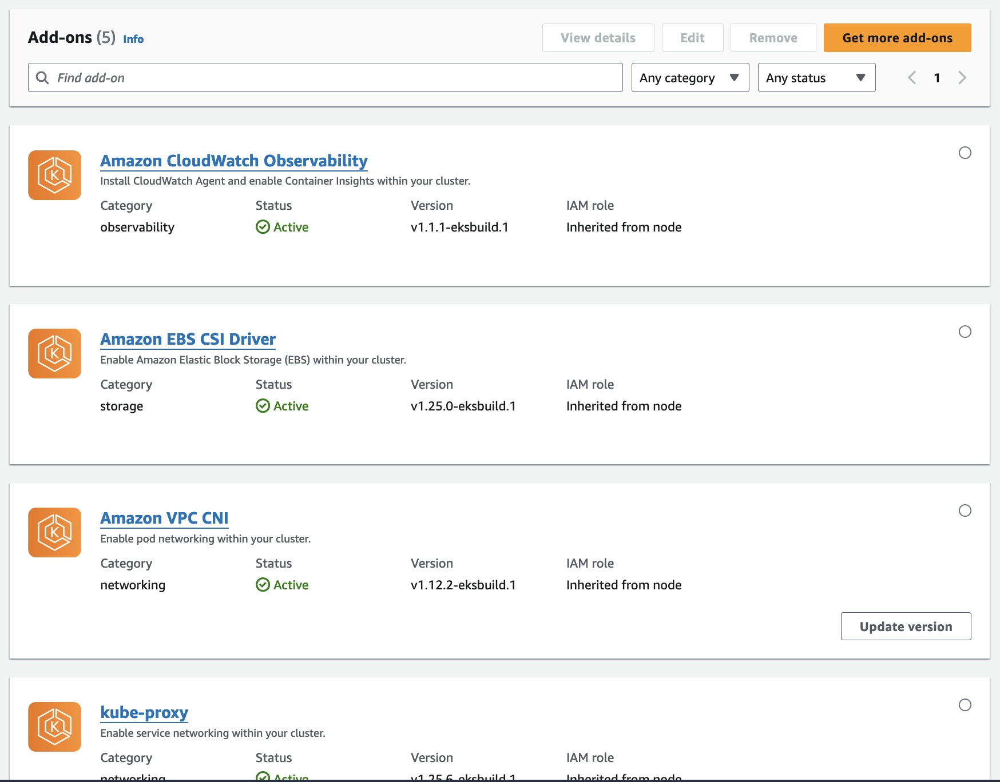

## Introduction

- Create an EKS cluster
- Networking requirements
- Add NodeGroup and Fargate Profile
- Add add-on for observability

> [!IMPORTANT]  
> Creating a new EKS cluster takes about 10 minutes. Add STS VPC Endpoint so pods in private subnets can get credentials via the STS endpoint. Please pay attention to number of IP avaiable and security group.

## Control Plane Role

Fole for control plane to manage the cluster by following [this docs](https://docs.aws.amazon.com/eks/latest/userguide/service_IAM_role.html#create-service-role)

```ts
// cluster role
const role = new aws_iam.Role(this, `RoleForEksCluster-${props.clusterName}`, {
  roleName: `RoleForEksCluster-${props.clusterName}`,
  assumedBy: new aws_iam.ServicePrincipal("eks.amazonaws.com"),
});

role.addManagedPolicy(
  aws_iam.ManagedPolicy.fromAwsManagedPolicyName("AmazonEKSClusterPolicy")
);
```

Here is the [AmazonEKSClusterPolicy](https://docs.aws.amazon.com/aws-managed-policy/latest/reference/AmazonEKSClusterPolicy.html)

## Control Plane Networking

- At least two subnets in different AZ [here](https://docs.aws.amazon.com/eks/latest/userguide/network_reqs.html)
- The subnets must each have at least six IP addresses for use by Amazon EKS. However, we recommend at least 16 IP addresses
- The subnets can be a public or private. However, we recommend that you specify private subnets, if possible.

> Pods configured with IAM roles for service accounts acquire credentials from an AWS Security Token Service (AWS STS) API call. If there is no outbound internet access, you must create and use an AWS STS VPC endpoint in your VPC

<details>

<summary>EksClusterStack</summary>

```ts
import {
  CfnResource,
  Stack,
  StackProps,
  aws_ec2,
  aws_eks,
  aws_iam,
} from "aws-cdk-lib";
import { Construct } from "constructs";

interface EksClusterProps extends StackProps {
  clusterName: string;
  eksSecurityGroup: aws_ec2.SecurityGroup;
  vpc: aws_ec2.Vpc;
}

export class EksClusterStack extends Stack {
  constructor(scope: Construct, id: string, props: EksClusterProps) {
    super(scope, id, props);

    const subnets: string[] = props.vpc.privateSubnets.map((subnet) =>
      subnet.subnetId.toString()
    );

    // cluster role
    const role = new aws_iam.Role(
      this,
      `RoleForEksCluster-${props.clusterName}`,
      {
        roleName: `RoleForEksCluster-${props.clusterName}`,
        assumedBy: new aws_iam.ServicePrincipal("eks.amazonaws.com"),
      }
    );

    role.addManagedPolicy(
      aws_iam.ManagedPolicy.fromAwsManagedPolicyName("AmazonEKSClusterPolicy")
    );

    // create eks cluster using level 1 CDK construct same as CF
    const cluster = new aws_eks.CfnCluster(
      this,
      `EksCluster-${props.clusterName}`,
      {
        name: props.clusterName,
        version: "1.25",
        resourcesVpcConfig: {
          // at least two subnets in different zones
          // at least 6 ip address, recommended 16
          subnetIds: subnets,
          //
          endpointPrivateAccess: false,
          //
          endpointPublicAccess: true,
          // cidr block allowed to access cluster
          // default 0/0
          publicAccessCidrs: ["0.0.0.0/0"],
          // eks will create a security group to allow
          // communication between control and data plane
          // nodegroup double check
          securityGroupIds: [props.eksSecurityGroup.securityGroupId],
        },
        kubernetesNetworkConfig: {
          // don not overlap with VPC
          // serviceIpv4Cidr: "",
        },
        // role for eks call aws service on behalf of you
        roleArn: role.roleArn,
        logging: {
          // by deault control plan logs is not exported to CW
          clusterLogging: {
            enabledTypes: [
              {
                // api | audit | authenticator | controllerManager
                type: "api",
              },
              {
                type: "controllerManager",
              },
              {
                type: "scheduler",
              },
              {
                type: "authenticator",
              },
              {
                type: "audit",
              },
            ],
          },
        },
      }
    );

    // node role
    const nodeRole = new aws_iam.Role(
      this,
      `RoleForEksNode-${props.clusterName}`,
      {
        roleName: `RoleForEksNode-${props.clusterName}`,
        assumedBy: new aws_iam.ServicePrincipal("ec2.amazonaws.com"),
      }
    );

    // attach policies for node role
    nodeRole.addManagedPolicy(
      aws_iam.ManagedPolicy.fromAwsManagedPolicyName(
        "AmazonEKSWorkerNodePolicy"
      )
    );

    nodeRole.addManagedPolicy(
      aws_iam.ManagedPolicy.fromAwsManagedPolicyName(
        "AmazonEC2ContainerRegistryReadOnly"
      )
    );

    nodeRole.addManagedPolicy(
      aws_iam.ManagedPolicy.fromAwsManagedPolicyName("AmazonEKS_CNI_Policy")
    );

    nodeRole.addManagedPolicy(
      aws_iam.ManagedPolicy.fromAwsManagedPolicyName(
        "CloudWatchAgentServerPolicy"
      )
    );

    // add inline policy to work with auto-scaling group
    nodeRole.addToPolicy(
      new aws_iam.PolicyStatement({
        effect: aws_iam.Effect.ALLOW,
        actions: [
          "autoscaling:DescribeAutoScalingGroups",
          "autoscaling:DescribeAutoScalingInstances",
          "autoscaling:DescribeLaunchConfigurations",
          "autoscaling:DescribeTags",
          "autoscaling:SetDesiredCapacity",
          "autoscaling:TerminateInstanceInAutoScalingGroup",
          "ec2:DescribeLaunchTemplateVersions",
        ],
        resources: ["*"],
      })
    );

    // optional: update auto-scaling group tags

    // access s3 and polly
    nodeRole.addManagedPolicy(
      aws_iam.ManagedPolicy.fromAwsManagedPolicyName("AmazonS3FullAccess")
    );

    nodeRole.addManagedPolicy(
      aws_iam.ManagedPolicy.fromAwsManagedPolicyName("AmazonPollyFullAccess")
    );

    nodeRole.addManagedPolicy(
      aws_iam.ManagedPolicy.fromAwsManagedPolicyName(
        "service-role/AmazonEBSCSIDriverPolicy"
      )
    );

    // aws managed nodegroup
    const nodegroup = new aws_eks.CfnNodegroup(
      this,
      "AWSManagedNodeGroupDemo",
      {
        nodegroupName: "AWSManagedNodeGroupDemo",
        // kubernetes version default from cluster
        // version: "",
        nodeRole: nodeRole.roleArn,
        clusterName: cluster.name!,
        subnets: subnets,
        // eks ami release version default latest
        // releaseVersion: ,
        capacityType: "ON_DEMAND",
        // default t3.medium
        instanceTypes: ["t3.xlarge"],
        diskSize: 50,
        // ssh remote access
        // remoteAccess: {
        //   ec2SshKey: "eks-node-ssh",
        // },
        // scaling configuration
        scalingConfig: {
          desiredSize: 2,
          maxSize: 22,
          minSize: 1,
        },
        // update configuration rolling update
        updateConfig: {
          maxUnavailable: 1,
          // maxUnavailablePercentage: 30,
        },
        // label configuration
        labels: {
          environment: "dev",
        },
      }
    );

    // fargate profile
    const podRole = new aws_iam.Role(
      this,
      `RoleForFargatePod-${props.clusterName}`,
      {
        roleName: `RoleForFargatePod-${props.clusterName}`,
        assumedBy: new aws_iam.ServicePrincipal(
          "eks-fargate-pods.amazonaws.com"
        ),
      }
    );

    podRole.addManagedPolicy(
      aws_iam.ManagedPolicy.fromAwsManagedPolicyName(
        "AmazonEKSFargatePodExecutionRolePolicy"
      )
    );

    podRole.addManagedPolicy(
      aws_iam.ManagedPolicy.fromAwsManagedPolicyName(
        "CloudWatchAgentServerPolicy"
      )
    );

    // fargate profile for app
    const appFargateProfile = new aws_eks.CfnFargateProfile(
      this,
      "FirstFargateProfileDemo1",
      {
        clusterName: cluster.name!,
        podExecutionRoleArn: podRole.roleArn,
        selectors: [
          {
            namespace: "demo",
            labels: [
              {
                key: "environment",
                value: "dev",
              },
            ],
          },
        ],
        fargateProfileName: "demo",
        // default all private subnet in the vpc
        subnets: subnets,
        tags: [
          {
            key: "name",
            value: "test",
          },
        ],
      }
    );

    // fargate profile for monitor
    //    const monitorFargateProfile = new aws_eks.CfnFargateProfile(
    //      this,
    //      "MonitorFargateProfile",
    //      {
    //        clusterName: cluster.name!,
    //        podExecutionRoleArn: podRole.roleArn,
    //        selectors: [
    //          {
    //            namespace: "fargate-container-insights",
    //            labels: [],
    //          },
    //        ],
    //        fargateProfileName: "monitor",
    //        // default all private subnet in the vpc
    //        subnets: subnets,
    //        tags: [
    //          {
    //            key: "name",
    //            value: "test",
    //          },
    //        ],
    //      }
    //    );

    // dependencies
    cluster.addDependency(role.node.defaultChild as CfnResource);
    nodegroup.addDependency(cluster);
    //    monitorFargateProfile.addDependency(cluster);
    appFargateProfile.addDependency(cluster);
  }
}
```

</details>

## Compute and NodeGroup

- AWS managed nodegroup
- Self managed nodegroup
- Fargate profile

Let create an AWS managed nodegroup

- create a lable for this group
- pay attention to total vCPU limit [HERE](https://aws.amazon.com/ec2/faqs/#EC2_On-Demand_Instance_limits)

> Running On-Demand Standard (A, C, D, H, I, M, R, T, Z) instances 1152 vCPUs

```ts
const nodegroup = new aws_eks.CfnNodegroup(this, "AWSManagedNodeGroupDemo", {
  nodegroupName: "AWSManagedNodeGroupDemo",
  // kubernetes version default from cluster
  // version: "",
  nodeRole: nodeRole.roleArn,
  clusterName: cluster.name!,
  subnets: subnets,
  // eks ami release version default latest
  // releaseVersion: ,
  capacityType: "ON_DEMAND",
  // default t3.medium
  instanceTypes: ["t2.medium"],
  diskSize: 50,
  // ssh remote access
  // remoteAccess: {
  //   ec2SshKey: "eks-node-ssh",
  // },
  // scaling configuration
  scalingConfig: {
    desiredSize: 2,
    maxSize: 22,
    minSize: 1,
  },
  // update configuration rolling update
  updateConfig: {
    maxUnavailable: 1,
    // maxUnavailablePercentage: 30,
  },
  // label configuration
  labels: {
    environment: "dev",
  },
});
```

Let add Fargate profile. First need to create pod role which assume by the AWS Fargate Profile so it can

- Register faragate to the cluster as ndoe
- Pull container images from ECR

> Please configure POD selectors by specifying namespace and match labels

```ts
// fargate profile
const podRole = new aws_iam.Role(
  this,
  `RoleForFargatePod-${props.clusterName}`,
  {
    roleName: `RoleForFargatePod-${props.clusterName}`,
    assumedBy: new aws_iam.ServicePrincipal("eks-fargate-pods.amazonaws.com"),
  }
);

podRole.addManagedPolicy(
  aws_iam.ManagedPolicy.fromAwsManagedPolicyName(
    "AmazonEKSFargatePodExecutionRolePolicy"
  )
);

podRole.addManagedPolicy(
  aws_iam.ManagedPolicy.fromAwsManagedPolicyName("CloudWatchAgentServerPolicy")
);
```

Then create a Fargate profile

```ts
const appFargateProfile = new aws_eks.CfnFargateProfile(
  this,
  "FirstFargateProfileDemo1",
  {
    clusterName: cluster.name!,
    podExecutionRoleArn: podRole.roleArn,
    selectors: [
      {
        namespace: "demo",
        labels: [
          {
            key: "environment",
            value: "dev",
          },
        ],
      },
    ],
    fargateProfileName: "demo",
    // default all private subnet in the vpc
    subnets: subnets,
    tags: [
      {
        key: "name",
        value: "test",
      },
    ],
  }
);
```

## Kubeconfig

Install kubectl by following [this](https://docs.aws.amazon.com/eks/latest/userguide/install-kubectl.html), following command is for Kubernetes 1.26

```bash
curl -O https://s3.us-west-2.amazonaws.com/amazon-eks/1.26.10/2023-11-14/bin/linux/amd64/kubectl
```

Update kubeconfig

```bash
aws eks update-kubeconfig --name demo --role-arn arn:aws:iam::575808125544:role/cdk-hnb659fds-cfn-exec-role-575808125544-ap-southeast-1
```

## Container Insights

- Option 1. Update NodeRole
- Option 2. ServiceAccount

Then there are two options to install CloudWatch Container Insights

- Option 1. From AWS EKS Console add add-ons
- Option 2. Using YAML files



<details>
<summary>NodeRole</summary>

```ts
// node role
const nodeRole = new aws_iam.Role(this, `RoleForEksNode-${props.clusterName}`, {
  roleName: `RoleForEksNode-${props.clusterName}`,
  assumedBy: new aws_iam.ServicePrincipal("ec2.amazonaws.com"),
});

// attach policies for node role
nodeRole.addManagedPolicy(
  aws_iam.ManagedPolicy.fromAwsManagedPolicyName("AmazonEKSWorkerNodePolicy")
);

nodeRole.addManagedPolicy(
  aws_iam.ManagedPolicy.fromAwsManagedPolicyName(
    "AmazonEC2ContainerRegistryReadOnly"
  )
);

nodeRole.addManagedPolicy(
  aws_iam.ManagedPolicy.fromAwsManagedPolicyName("AmazonEKS_CNI_Policy")
);

nodeRole.addManagedPolicy(
  aws_iam.ManagedPolicy.fromAwsManagedPolicyName("CloudWatchAgentServerPolicy")
);

// add inline policy to work with auto-scaling group
nodeRole.addToPolicy(
  new aws_iam.PolicyStatement({
    effect: aws_iam.Effect.ALLOW,
    actions: [
      "autoscaling:DescribeAutoScalingGroups",
      "autoscaling:DescribeAutoScalingInstances",
      "autoscaling:DescribeLaunchConfigurations",
      "autoscaling:DescribeTags",
      "autoscaling:SetDesiredCapacity",
      "autoscaling:TerminateInstanceInAutoScalingGroup",
      "ec2:DescribeLaunchTemplateVersions",
    ],
    resources: ["*"],
  })
);

// optional: update auto-scaling group tags

// access s3 and polly
nodeRole.addManagedPolicy(
  aws_iam.ManagedPolicy.fromAwsManagedPolicyName("AmazonS3FullAccess")
);

nodeRole.addManagedPolicy(
  aws_iam.ManagedPolicy.fromAwsManagedPolicyName("AmazonPollyFullAccess")
);
```

</details>

- Option 1. Install with IAM permissions on worker nodes

```bash
aws iam attach-role-policy \
--role-name my-worker-node-role \
--policy-arn arn:aws:iam::aws:policy/CloudWatchAgentServerPolicy
```

- Option 2. Service account

First create a new service account

```bash
eksctl utils associate-iam-oidc-provider --cluster my-cluster-name --approve
```

Second, associate IAM permissions with the service account

```bash
eksctl create iamserviceaccount \
  --name cloudwatch-agent \
  --namespace amazon-cloudwatch --cluster my-cluster-name \
  --role-name my-service-account-role \
  --attach-policy-arn arn:aws:iam::aws:policy/CloudWatchAgentServerPolicy \
  --role-only \
  --approve
```

Third, install add-on

```bash
aws eks create-addon --addon-name amazon-cloudwatch-observability --cluster-name my-cluster-name --service-account-role-arn arn:aws:iam::111122223333:role/my-service-account-role
```

Verify result to see that cloudwatch agent and fluentbit installed in EC2 nodes

```bash
kubectl get nodes -A
```

```bash
amazon-cloudwatch   amazon-cloudwatch-observability-controller-manager-6cf4fc98nkl4   1/1     Running   0          24s
amazon-cloudwatch   cloudwatch-agent-2n54h                                            1/1     Running   0          13s
amazon-cloudwatch   cloudwatch-agent-fkqzf                                            1/1     Running   0          13s
amazon-cloudwatch   fluent-bit-676qz                                                  1/1     Running   0          24s
amazon-cloudwatch   fluent-bit-6sd7q                                                  1/1     Running   0          24s
kube-system         aws-node-5jrcc                                                    1/1     Running   0          30m
kube-system         aws-node-6999g                                                    1/1     Running   0          30m
kube-system         coredns-7bc775787b-7tk6n                                          1/1     Running   0          50m
kube-system         coredns-7bc775787b-hhdnm                                          1/1     Running   0          50m
kube-system         kube-proxy-lsxqq                                                  1/1     Running   0          30m
kube-system         kube-proxy-zxzr6                                                  1/1     Running   0          30m
```

Go to cloudwatch insights and loggroup to see metrics and logs

## Launch App

Here is a stable-diffusion app

<details>
<summary>stable-diffusion-app.yaml</summary>

```yaml
apiVersion: v1
kind: Service
metadata:
  name: next-diffusion-app-service
  annotations:
    service.beta.kubernetes.io/aws-load-balancer-backend-protocol: http
    service.beta.kubernetes.io/aws-load-balancer-ssl-cert: arn:aws:acm:ap-southeast-1:796344100568:certificate/4edd9ff9-917a-4e1f-a07a-f98215e9d8e9
    service.beta.kubernetes.io/aws-load-balancer-ssl-ports: https
spec:
  ports:
    - port: 80
      targetPort: 3000
      name: http
    - port: 443
      targetPort: 3000
      name: https
  selector:
    app: next-diffusion-app
  type: LoadBalancer
---
apiVersion: apps/v1
kind: Deployment
metadata:
  name: next-diffusion-app-deployment
spec:
  replicas: 2
  selector:
    matchLabels:
      app: next-diffusion-app
  template:
    metadata:
      labels:
        app: next-diffusion-app
    spec:
      containers:
        - image: 796344100568.dkr.ecr.ap-southeast-1.amazonaws.com/next-diffusion-app:latest
          name: next-diffusion-app
          ports:
            - containerPort: 3000
          resources:
            limits:
              cpu: 500m
            requests:
              cpu: 500m
---
apiVersion: autoscaling/v2beta2
kind: HorizontalPodAutoscaler
metadata:
  name: next-diffusion-app-hpa
spec:
  maxReplicas: 1000
  metrics:
    - resource:
        name: cpu
        target:
          averageUtilization: 5
          type: Utilization
      type: Resource
  minReplicas: 2
  scaleTargetRef:
    apiVersion: apps/v1
    kind: Deployment
    name: next-diffusion-app-deployment
```

</details>

Here is a simple book-app.yaml

<details>
<summary>book-app.yaml</summary>

```yaml
apiVersion: v1
kind: Service
metadata:
  name: book-app-service
  annotations:
    service.beta.kubernetes.io/aws-load-balancer-backend-protocol: http
    service.beta.kubernetes.io/aws-load-balancer-ssl-cert: arn:aws:acm:ap-southeast-1:575808125544:certificate/61d3f411-eba3-48dd-bb9a-fbea3481fc17
    service.beta.kubernetes.io/aws-load-balancer-ssl-ports: https
spec:
  ports:
    - port: 80
      targetPort: 8080
      name: http
    - port: 443
      targetPort: 8080
      name: https
  selector:
    app: book-app
  type: LoadBalancer
---
apiVersion: apps/v1
kind: Deployment
metadata:
  name: book-app-deployment
spec:
  replicas: 2
  selector:
    matchLabels:
      app: book-app
  template:
    metadata:
      labels:
        app: book-app
    spec:
      containers:
        - image: 575808125544.dkr.ecr.ap-southeast-1.amazonaws.com/book-app
          name: book-app
          ports:
            - containerPort: 8080
          resources:
            limits:
              cpu: 100m
            requests:
              cpu: 100m
---
apiVersion: autoscaling/v2
kind: HorizontalPodAutoscaler
metadata:
  name: book-app-hpa
  namespace: default
spec:
  maxReplicas: 1000
  metrics:
    - resource:
        name: cpu
        target:
          averageUtilization: 5
          type: Utilization
      type: Resource
  minReplicas: 2
  scaleTargetRef:
    apiVersion: apps/v1
    kind: Deployment
    name: book-app-deployment
```

</details>

Check log of pod

```bash
kubectl logs --tail=100 -f book-app-deployment-74fbc9b7-vglgj
```

> In case of two pods, I can see which request goto which pod or container

## Fargate Profile

- Namespace and Labels for pod selector
- ALB controller and ingress ==> Next Module

Here is a sample app which should be assigned to a fargate pod

```yaml
apiVersion: apps/v1
kind: Deployment
metadata:
  name: cdk8s-deployment
  namespace: demo
spec:
  replicas: 2
  selector:
    matchLabels:
      app: hello-cdk8s
      environment: dev 
  template:
    metadata:
      labels:
        app: hello-cdk8s
        environment: dev 
    spec:
      containers:
        - image: paulbouwer/hello-kubernetes:1.7
          name: hello-kubernetes
          ports:
            - containerPort: 8080
```

## Some Concepts

[**Managed NodeGroup**](https://docs.aws.amazon.com/eks/latest/userguide/managed-node-groups.html)

> Amazon EKS managed node groups automate the provisioning and lifecycle management of nodes (Amazon EC2 instances) for Amazon EKS Kubernetes clusters...There are no additional costs to use Amazon EKS managed node groups, you only pay for the AWS resources you provision.

[**Self Managed Node**](https://docs.aws.amazon.com/eks/latest/userguide/worker.html)

> A cluster contains one or more Amazon EC2 nodes that Pods are scheduled on. Amazon EKS nodes run in your AWS account and connect to the control plane of your cluster through the cluster API server endpoint. You're billed for them based on Amazon EC2 prices. For more information

[**Fargate Profile**](https://docs.aws.amazon.com/eks/latest/userguide/fargate.html)

> With Fargate, you don't have to provision, configure, or scale groups of virtual machines on your own to run containers. You also don't need to choose server types, decide when to scale your node groups, or optimize cluster packing.

[**Tain and Affinity**](https://kubernetes.io/docs/concepts/scheduling-eviction/taint-and-toleration/)

> Node selectors/affinity, based on node labels, enables pods to be assigned to a set of nodes (either as a preference or a hard requirement). Taints are the opposite — they allow a node to repel a set of pods.

> Taints and tolerations work together to ensure that pods are not scheduled onto inappropriate nodes. One or more taints are applied to a node; this marks that the node should not accept any pods that do not tolerate the taints.

[**Splot Instance**](https://aws.amazon.com/blogs/containers/seamlessly-migrate-workloads-from-eks-self-managed-node-group-to-eks-managed-node-groups/)

> If Spot Instances are used with managed node groups, EKS handles the termination of Spot Instances gracefully. When Spot Instances receive a two-minute termination notice, EKS will reallocate the pods that are running to other active instances. This will avoid abrupt termination of pods when Spot Instances are terminated.

[**Karpenter**](https://aws.amazon.com/blogs/containers/how-costar-uses-karpenter-to-optimize-their-amazon-eks-resources/)

> CoStar needed a more efficient means of provisioning nodes for their diverse workload demands without the overhead of management of multiple node groups.

>

## Reference

- [STS VPC Endpoint for IAM Roles for Service Accounts](https://docs.aws.amazon.com/eks/latest/userguide/private-clusters.html)

- [Default vCPU Limit](https://aws.amazon.com/ec2/faqs/#EC2_On-Demand_Instance_limits)

- [Install kubectl](https://docs.aws.amazon.com/eks/latest/userguide/install-kubectl.html)

- [Selector Affinity]()

- [Managed Nodegroup]()

- [Fargate Profile](https://docs.aws.amazon.com/eks/latest/userguide/fargate-profile.html)

- [Self Managed Group](https://docs.aws.amazon.com/eks/latest/userguide/managed-node-groups.html)

- [GPU Node and Spot Node]()

- [Container Insights](https://docs.aws.amazon.com/AmazonCloudWatch/latest/monitoring/install-CloudWatch-Observability-EKS-addon.html)

- [Migrate Self-Managed to AWS Managed Node](https://aws.amazon.com/blogs/containers/seamlessly-migrate-workloads-from-eks-self-managed-node-group-to-eks-managed-node-groups/)

- [Karpenter CoStar](https://aws.amazon.com/blogs/containers/how-costar-uses-karpenter-to-optimize-their-amazon-eks-resources/)

- [Karpenter Spot Instance](https://aws.amazon.com/blogs/containers/using-amazon-ec2-spot-instances-with-karpenter/)

- [Introducing to Karpender on Amazon EKS 2021](https://aws.amazon.com/blogs/aws/introducing-karpenter-an-open-source-high-performance-kubernetes-cluster-autoscaler/)

- [Migrate Cluster AutoScaler to Karpenter](https://karpenter.sh/docs/getting-started/migrating-from-cas/)

- [Generative AI on Amazon EKS](https://aws.amazon.com/blogs/containers/deploy-generative-ai-models-on-amazon-eks/)
