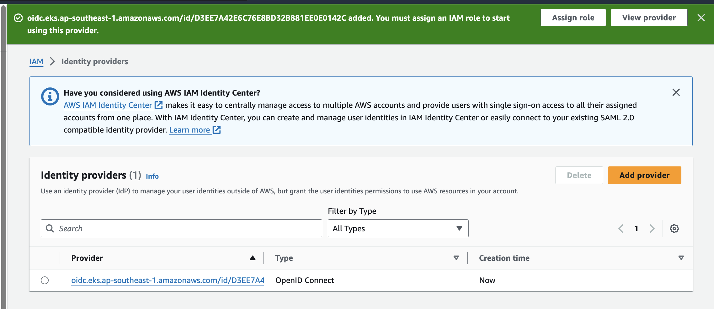

## Introduction

[GitHub](https://github.com/cdk-entest/eks-cdk-launch/tree/master/karpenter) this note shows how to setup Karpenter for Amazon EKS.

- Service account for the Karpenter as a controller
- Setup node role and controller role
- Setup Karpenter provisioner
- ttlSecondsAfterEmpty for scale in

## OIDC IAM Provider

> Please setup the OIDC IAM Provider



## Node Role

Get variables

```bash
AWS_PARTITION="aws" # if you are not using standard partitions, you may need to configure to aws-cn / aws-us-gov
AWS_REGION="$(aws configure list | grep region | tr -s " " | cut -d" " -f3)"
OIDC_ENDPOINT="$(aws eks describe-cluster --name demo \
    --query "cluster.identity.oidc.issuer" --output text)"
AWS_ACCOUNT_ID=$(aws sts get-caller-identity --query 'Account' \
    --output text)
```

Create iam role for node with trusted policy as below

<details>
<summary>node-trust-policy.json</summary>

```json
{
  "Version": "2012-10-17",
  "Statement": [
    {
      "Effect": "Allow",
      "Principal": {
        "Service": "ec2.amazonaws.com"
      },
      "Action": "sts:AssumeRole"
    }
  ]
}
```

</details>

Then create the node role

```bash
aws iam create-role --role-name "KarpenterNodeRole-${CLUSTER_NAME}" \
    --assume-role-policy-document file://node-trust-policy.json
```

Attach policies to the role

```bash
aws iam attach-role-policy --role-name "KarpenterNodeRole-${CLUSTER_NAME}" \
    --policy-arn arn:${AWS_PARTITION}:iam::aws:policy/AmazonEKSWorkerNodePolicy

aws iam attach-role-policy --role-name "KarpenterNodeRole-${CLUSTER_NAME}" \
    --policy-arn arn:${AWS_PARTITION}:iam::aws:policy/AmazonEKS_CNI_Policy

aws iam attach-role-policy --role-name "KarpenterNodeRole-${CLUSTER_NAME}" \
    --policy-arn arn:${AWS_PARTITION}:iam::aws:policy/AmazonEC2ContainerRegistryReadOnly

aws iam attach-role-policy --role-name "KarpenterNodeRole-${CLUSTER_NAME}" \
    --policy-arn arn:${AWS_PARTITION}:iam::aws:policy/AmazonSSMManagedInstanceCore
```

## Controller Role

Create controller policy with below trusted policy

<details>
<summary>controller-trust-policy.json</summary>

```json
{
  "Version": "2012-10-17",
  "Statement": [
    {
      "Effect": "Allow",
      "Principal": {
        "Federated": "arn:${AWS_PARTITION}:iam::${AWS_ACCOUNT_ID}:oidc-provider/${OIDC_ENDPOINT#*//}"
      },
      "Action": "sts:AssumeRoleWithWebIdentity",
      "Condition": {
        "StringEquals": {
          "${OIDC_ENDPOINT#*//}:aud": "sts.amazonaws.com",
          "${OIDC_ENDPOINT#*//}:sub": "system:serviceaccount:karpenter:karpenter"
        }
      }
    }
  ]
}
```

</details>

and the policies for permissions

<details>
<summary>controller-policy.json</summary>

```json
{
  "Statement": [
    {
      "Action": [
        "ssm:GetParameter",
        "ec2:DescribeImages",
        "ec2:RunInstances",
        "ec2:DescribeSubnets",
        "ec2:DescribeSecurityGroups",
        "ec2:DescribeLaunchTemplates",
        "ec2:DescribeInstances",
        "ec2:DescribeInstanceTypes",
        "ec2:DescribeInstanceTypeOfferings",
        "ec2:DescribeAvailabilityZones",
        "ec2:DeleteLaunchTemplate",
        "ec2:CreateTags",
        "ec2:CreateLaunchTemplate",
        "ec2:CreateFleet",
        "ec2:DescribeSpotPriceHistory",
        "pricing:GetProducts"
      ],
      "Effect": "Allow",
      "Resource": "*",
      "Sid": "Karpenter"
    },
    {
      "Action": "ec2:TerminateInstances",
      "Condition": {
        "StringLike": {
          "ec2:ResourceTag/karpenter.sh/nodepool": "*"
        }
      },
      "Effect": "Allow",
      "Resource": "*",
      "Sid": "ConditionalEC2Termination"
    },
    {
      "Effect": "Allow",
      "Action": "iam:PassRole",
      "Resource": "arn:${AWS_PARTITION}:iam::${AWS_ACCOUNT_ID}:role/KarpenterNodeRole-${CLUSTER_NAME}",
      "Sid": "PassNodeIAMRole"
    },
    {
      "Effect": "Allow",
      "Action": "eks:DescribeCluster",
      "Resource": "arn:${AWS_PARTITION}:eks:${AWS_REGION}:${AWS_ACCOUNT_ID}:cluster/${CLUSTER_NAME}",
      "Sid": "EKSClusterEndpointLookup"
    },
    {
      "Sid": "AllowScopedInstanceProfileCreationActions",
      "Effect": "Allow",
      "Resource": "*",
      "Action": ["iam:CreateInstanceProfile"],
      "Condition": {
        "StringEquals": {
          "aws:RequestTag/kubernetes.io/cluster/${CLUSTER_NAME}": "owned",
          "aws:RequestTag/topology.kubernetes.io/region": "${AWS_REGION}"
        },
        "StringLike": {
          "aws:RequestTag/karpenter.k8s.aws/ec2nodeclass": "*"
        }
      }
    },
    {
      "Sid": "AllowScopedInstanceProfileTagActions",
      "Effect": "Allow",
      "Resource": "*",
      "Action": ["iam:TagInstanceProfile"],
      "Condition": {
        "StringEquals": {
          "aws:ResourceTag/kubernetes.io/cluster/${CLUSTER_NAME}": "owned",
          "aws:ResourceTag/topology.kubernetes.io/region": "${AWS_REGION}",
          "aws:RequestTag/kubernetes.io/cluster/${CLUSTER_NAME}": "owned",
          "aws:RequestTag/topology.kubernetes.io/region": "${AWS_REGION}"
        },
        "StringLike": {
          "aws:ResourceTag/karpenter.k8s.aws/ec2nodeclass": "*",
          "aws:RequestTag/karpenter.k8s.aws/ec2nodeclass": "*"
        }
      }
    },
    {
      "Sid": "AllowScopedInstanceProfileActions",
      "Effect": "Allow",
      "Resource": "*",
      "Action": [
        "iam:AddRoleToInstanceProfile",
        "iam:RemoveRoleFromInstanceProfile",
        "iam:DeleteInstanceProfile"
      ],
      "Condition": {
        "StringEquals": {
          "aws:ResourceTag/kubernetes.io/cluster/${CLUSTER_NAME}": "owned",
          "aws:ResourceTag/topology.kubernetes.io/region": "${AWS_REGION}"
        },
        "StringLike": {
          "aws:ResourceTag/karpenter.k8s.aws/ec2nodeclass": "*"
        }
      }
    },
    {
      "Sid": "AllowInstanceProfileReadActions",
      "Effect": "Allow",
      "Resource": "*",
      "Action": "iam:GetInstanceProfile"
    }
  ],
  "Version": "2012-10-17"
}
```

</details>

Then create the controller role

```bash
aws iam create-role --role-name KarpenterControllerRole-${CLUSTER_NAME} \
    --assume-role-policy-document file://controller-trust-policy.json


aws iam put-role-policy --role-name KarpenterControllerRole-${CLUSTER_NAME} \
    --policy-name KarpenterControllerPolicy-${CLUSTER_NAME} \
    --policy-document file://controller-policy.json
```

## NodeGroup

Add tag to nodegroup

```bash
for NODEGROUP in $(aws eks list-nodegroups --cluster-name ${CLUSTER_NAME} \
    --query 'nodegroups' --output text); do aws ec2 create-tags \
        --tags "Key=karpenter.sh/discovery,Value=${CLUSTER_NAME}" \
        --resources $(aws eks describe-nodegroup --cluster-name ${CLUSTER_NAME} \
        --nodegroup-name $NODEGROUP --query 'nodegroup.subnets' --output text )
done
```

Add tag to security group

```bash
NODEGROUP=$(aws eks list-nodegroups --cluster-name ${CLUSTER_NAME} \
    --query 'nodegroups[0]' --output text)

LAUNCH_TEMPLATE=$(aws eks describe-nodegroup --cluster-name ${CLUSTER_NAME} \
    --nodegroup-name ${NODEGROUP} --query 'nodegroup.launchTemplate.{id:id,version:version}' \
    --output text | tr -s "\t" ",")

# If your EKS setup is configured to use only Cluster security group, then please execute -

SECURITY_GROUPS=$(aws eks describe-cluster \
    --name ${CLUSTER_NAME} --query "cluster.resourcesVpcConfig.clusterSecurityGroupId" --output text)

# If your setup uses the security groups in the Launch template of a managed node group, then :

SECURITY_GROUPS=$(aws ec2 describe-launch-template-versions \
    --launch-template-id ${LAUNCH_TEMPLATE%,*} --versions ${LAUNCH_TEMPLATE#*,} \
    --query 'LaunchTemplateVersions[0].LaunchTemplateData.[NetworkInterfaces[0].Groups||SecurityGroupIds]' \
    --output text)

aws ec2 create-tags \
    --tags "Key=karpenter.sh/discovery,Value=${CLUSTER_NAME}" \
    --resources ${SECURITY_GROUPS}
```

## ConfigMap

Update aws-auth ConfigMap

```bash
kubectl edit configmap aws-auth -n kube-system
```

```yaml
- groups:
    - system:bootstrappers
    - system:nodes
  rolearn: arn:aws:iam::575808125544:role/KarpenterNodeRole-demo
  username: system:node:{{EC2PrivateDNSName}}
```

## Helm Karpenter

Export Karpenter version

```bash
export KARPENTER_VERSION=v0.31.0
```

Finally install it

```bash
helm template karpenter oci://public.ecr.aws/karpenter/karpenter --version ${KARPENTER_VERSION} --namespace karpenter \
    --set settings.clusterName=${CLUSTER_NAME} \
    --set serviceAccount.annotations."eks\.amazonaws\.com/role-arn"="arn:${AWS_PARTITION}:iam::${AWS_ACCOUNT_ID}:role/KarpenterControllerRole-${CLUSTER_NAME}" \
    --set controller.resources.requests.cpu=1 \
    --set controller.resources.requests.memory=1Gi \
    --set controller.resources.limits.cpu=1 \
    --set controller.resources.limits.memory=1Gi > karpenter.yaml
```

Deploy Karpenter

```bash
kubectl create namespace karpenter
kubectl create -f \
    https://raw.githubusercontent.com/aws/karpenter/${KARPENTER_VERSION}/pkg/apis/crds/karpenter.sh_nodepools.yaml
kubectl create -f \
    https://raw.githubusercontent.com/aws/karpenter/${KARPENTER_VERSION}/pkg/apis/crds/karpenter.k8s.aws_ec2nodeclasses.yaml
kubectl create -f \
    https://raw.githubusercontent.com/aws/karpenter/${KARPENTER_VERSION}/pkg/apis/crds/karpenter.sh_nodeclaims.yaml
kubectl apply -f karpenter.yaml
```

```bash
kubectl delete -f \
    https://raw.githubusercontent.com/aws/karpenter/${KARPENTER_VERSION}/pkg/apis/crds/karpenter.sh_nodepools.yaml
kubectl delete -f \
    https://raw.githubusercontent.com/aws/karpenter/${KARPENTER_VERSION}/pkg/apis/crds/karpenter.k8s.aws_ec2nodeclasses.yaml
kubectl delete -f \
    https://raw.githubusercontent.com/aws/karpenter/${KARPENTER_VERSION}/pkg/apis/crds/karpenter.sh_nodeclaims.yaml
kubectl delete -f karpenter.yaml
```

```bash
helm upgrade --install karpenter-crd oci://public.ecr.aws/karpenter/karpenter-crd --version v0.31.0--namespace karpenter
```

```bash
helm repo add karpenter https://charts.karpenter.sh
helm repo update
helm upgrade --install --skip-crds karpenter karpenter/karpenter --namespace karpenter \
  --create-namespace --set serviceAccount.create=false --version 0.5.0 \
  --set controller.clusterName=demo \
  --set controller.clusterEndpoint=$(aws eks describe-cluster --name demo --query "cluster.endpoint" --output json) \
  --wait # for the defaulting webhook to install before creating a Provisioner
```

## Remove Auto Scaler

```bash
kubectl scale deploy/cluster-autoscaler -n kube-system --replicas=0
```

## Karpenter provisoner

Let create a provisioner

- Include which instance type
- Exclude which instance type

<details>
<summary>provisioner</summary>

```yaml
# This example provisioner will provision general purpose instances
apiVersion: karpenter.sh/v1alpha5
kind: Provisioner
metadata:
  name: default
spec:
  requirements:
    # Include general purpose instance families
    - key: karpenter.k8s.aws/instance-family
      operator: In
      values: [t3, c3, m3]
    # Exclude small instance sizes
    - key: karpenter.k8s.aws/instance-size
      operator: In
      values: [small, medium, large, 2xlarge]
  providerRef:
    name: default
---
apiVersion: karpenter.k8s.aws/v1alpha1
kind: AWSNodeTemplate
metadata:
  name: default
spec:
  instanceProfile: "eks-dcc5f320-53e6-b45f-8d4c-f736c0656449"
  subnetSelector:
    karpenter.sh/discovery: "demo" # replace with your cluster name
  securityGroupSelector:
    karpenter.sh/discovery: "demo" # replace with your cluster name
```

</details>

## Launch App

Launch a boo-app.yaml with 1 pods

<details>
<summary>book-app.yaml</summary>

```yaml
apiVersion: v1
kind: Service
metadata:
  name: book-app-service
  annotations:
    service.beta.kubernetes.io/aws-load-balancer-backend-protocol: http
    service.beta.kubernetes.io/aws-load-balancer-ssl-cert: arn:aws:acm:ap-southeast-1:575808125544:certificate/61d3f411-eba3-48dd-bb9a-fbea3481fc17
    service.beta.kubernetes.io/aws-load-balancer-ssl-ports: https
spec:
  ports:
    - port: 80
      targetPort: 8080
      name: http
    - port: 443
      targetPort: 8080
      name: https
  selector:
    app: book-app
  type: LoadBalancer
---
apiVersion: apps/v1
kind: Deployment
metadata:
  name: book-app-deployment
spec:
  replicas: 1
  selector:
    matchLabels:
      app: book-app
  template:
    metadata:
      labels:
        app: book-app
    spec:
      containers:
        - image: 575808125544.dkr.ecr.ap-southeast-1.amazonaws.com/book-app
          name: book-app
          ports:
            - containerPort: 8080
          resources:
            limits:
              cpu: 1
            requests:
              cpu: 1
---
apiVersion: autoscaling/v2
kind: HorizontalPodAutoscaler
metadata:
  name: book-app-hpa
  namespace: default
spec:
  maxReplicas: 1000
  metrics:
    - resource:
        name: cpu
        target:
          averageUtilization: 5
          type: Utilization
      type: Resource
  minReplicas: 2
  scaleTargetRef:
    apiVersion: apps/v1
    kind: Deployment
    name: book-app-deployment
```

</details>

scale an app to see Karpenter works

```bash
kubectl scale deployment book-app-deployment --replicas 30
```

check the logs

```bash
kubectl logs -f -n karpenter -c controller -l app.kubernetes.io/name=karpenter
```

create an app

```bash
kubectl create deployment inflate --image=public.ecr.aws/eks-distro/kubernetes/pause:3.2 --requests.cpu=1
```

## Reference

- [Karpenter Introduction](https://aws.amazon.com/blogs/aws/introducing-karpenter-an-open-source-high-performance-kubernetes-cluster-autoscaler/)

- [Nodepool Beta](https://aws.amazon.com/blogs/containers/karpenter-graduates-to-beta/)

- [Karpenter Docs](https://karpenter.sh/v0.29/concepts/provisioners/#specproviderref)
