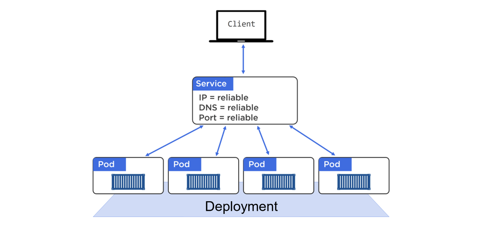
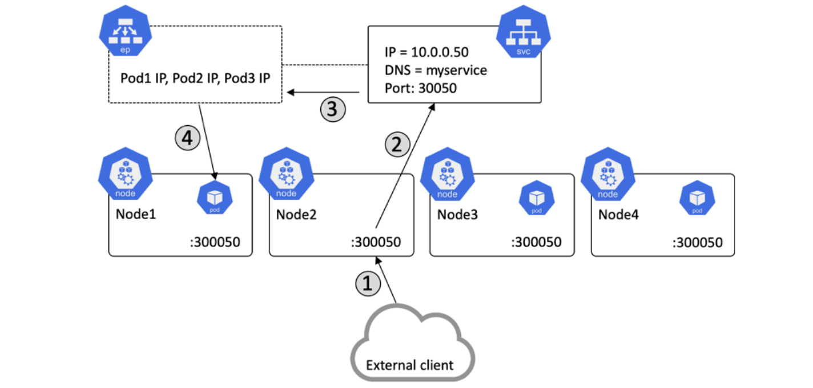

## Expose Service



[HERE - How do I expose service on Amazon EKS](https://repost.aws/knowledge-center/eks-kubernetes-services-cluster)

- ClusterIP exposes the service on a cluster's internal IP address.

- NodePort exposes the service on each node’s IP address at a static port.

- LoadBalancer exposes the service externally using a load balancer.

## Cluster IP

Create a deployment

```bash
kubectl create deployment myapp --image=nginx --port=80 --replicas=1 --dry-run=client --output=yaml > deploy.yaml
```

Here is deploy.yaml

```yaml
apiVersion: apps/v1
kind: Deployment
metadata:
  creationTimestamp: null
  labels:
    app: myapp
  name: myapp
spec:
  replicas: 2
  selector:
    matchLabels:
      app: myapp
  strategy: {}
  template:
    metadata:
      creationTimestamp: null
      labels:
        app: myapp
    spec:
      containers:
        - image: nginx
          name: nginx
          ports:
            - containerPort: 80
          resources: {}
status: {}
```

Create a ClusterIP service

```bash
kubectl create service clusterip myapp --tcp=80:80 --dry-run=client --output=yaml > service.yaml
```

Here is service.yaml

```yaml
apiVersion: v1
kind: Service
metadata:
  creationTimestamp: null
  labels:
    app: myapp
  name: myapp
spec:
  ports:
    - name: 80-80
      port: 80
      protocol: TCP
      targetPort: 80
  selector:
    app: myapp
  type: ClusterIP
status:
  loadBalancer: {}
```

Shell into a busy box and test

```bash
kubectl run test --image=busybox -it --rm -- /bin/sh
```

Then call the ClusterIP service

```bash
wget 10.100.185.170:80
```

> [!IMPORTANT]  
> Rollout update and the endpoint changes

```bash
kubectl rollout restart deployment/myapp
```

## NodePort



Just update the service type to NodePort as below.

```yaml
apiVersion: v1
kind: Service
metadata:
  creationTimestamp: null
  labels:
    app: myapp
  name: myapp
spec:
  ports:
    - name: 80-80
      port: 80
      protocol: TCP
      targetPort: 80
  selector:
    app: myapp
  type: NodePort
status:
  loadBalancer: {}
```

Get ip of nodes

```bash
kubectl get nodes -o wide
```

Then access the service on each node given the security group already configured for the port.

```bash
curl 192.168.4.101:3xxx
```

Double check the security group for NodeGroup open port 80 for 0/0 then remote access to an EC2 within the same VPC and test

```bash
describe service myapp -n default
```

Then test access

```bash
curl 192.168.5.184:80
```

## Load Balancer

Change the service to LoadBlancer and test

```yaml
apiVersion: v1
kind: Service
metadata:
  creationTimestamp: null
  labels:
    app: myapp
  name: myapp
spec:
  ports:
    - name: 80-80
      port: 80
      protocol: TCP
      targetPort: 80
  selector:
    app: myapp
  type: LoadBalancer
status:
  loadBalancer: {}
```

## ALB and Ingress


For Fargate on Amazon EKS, we have to install [ALB Ingress Controller](https://kubernetes-sigs.github.io/aws-load-balancer-controller/v2.6/how-it-works/). Let see and example with HTTPS here

```yaml
apiVersion: apps/v1
kind: Deployment
metadata:
  name: book-app-deployment
  namespace: demo
spec:
  replicas: 2
  selector:
    matchLabels:
      app: book-app
      environment: dev
  template:
    metadata:
      labels:
        app: book-app
        environment: dev
    spec:
      containers:
        - image: 913165135663.dkr.ecr.ap-southeast-1.amazonaws.com/book-app:latest
          name: book-app
          ports:
            - containerPort: 8080
          resources:
            limits:
              cpu: 500m
            requests:
              cpu: 500m
      serviceAccountName: book-app-service-account
---
apiVersion: v1
kind: Service
metadata:
  annotations:
    service.beta.kubernetes.io/aws-load-balancer-backend-protocol: http
    service.beta.kubernetes.io/aws-load-balancer-ssl-cert: arn:aws:acm:ap-southeast-1:913165135663:certificate/6d887518-c95e-47d9-a6c6-8d70af2f3335
    service.beta.kubernetes.io/aws-load-balancer-ssl-ports: https
  name: book-app-service
  namespace: demo
spec:
  ports:
    - name: http
      port: 80
      targetPort: 8080
    - name: https
      port: 443
      targetPort: 8080
  selector:
    app: book-app
    environment: dev
  type: NodePort
---
apiVersion: networking.k8s.io/v1
kind: Ingress
metadata:
  annotations:
    alb.ingress.kubernetes.io/certificate-arn: arn:aws:acm:ap-southeast-1:913165135663:certificate/6d887518-c95e-47d9-a6c6-8d70af2f3335
    alb.ingress.kubernetes.io/group.name: dev
    alb.ingress.kubernetes.io/listen-ports: '[{"HTTP": 80}, {"HTTPS":443}]'
    alb.ingress.kubernetes.io/scheme: internet-facing
    alb.ingress.kubernetes.io/ssl-redirect: "443"
    alb.ingress.kubernetes.io/subnets: subnet-0e5f4254929b7e561, subnet-00305ac19f5193603, subnet-0508f66e5cbddb927
    alb.ingress.kubernetes.io/target-type: ip
    kubernetes.io/ingress.class: alb
  name: book-app-ingress
  namespace: demo
spec:
  rules:
    - http:
        paths:
          - backend:
              service:
                name: book-app-service
                port:
                  number: 80
            path: /
            pathType: Prefix
```

## Network Policy

## Troubleshooting

Kube configure update

```bash
aws eks update-kubeconfig --name EksClusterLevel1 --role-arn arn:aws:iam::913165135663:role/cdk-hnb659fds-cfn-exec-role-913165135663-ap-southeast-1
```

## Reference

- [ingress](https://kubernetes.io/docs/concepts/services-networking/ingress/)

- [EKS Fargate and ALB](https://aws.amazon.com/blogs/opensource/kubernetes-ingress-aws-alb-ingress-controller/)

- [Multiple Applications on Amazon EKS using Single ALB](https://aws.amazon.com/blogs/containers/how-to-expose-multiple-applications-on-amazon-eks-using-a-single-application-load-balancer/)

- [Exposing Services EKS on ALB](https://aws.amazon.com/blogs/containers/exposing-kubernetes-applications-part-2-aws-load-balancer-controller/)

- [Knowledge center expose service on Amazon EKS](https://repost.aws/knowledge-center/eks-kubernetes-services-cluster)

- [ALB Ingress Controller](https://kubernetes-sigs.github.io/aws-load-balancer-controller/v2.6/how-it-works/)
